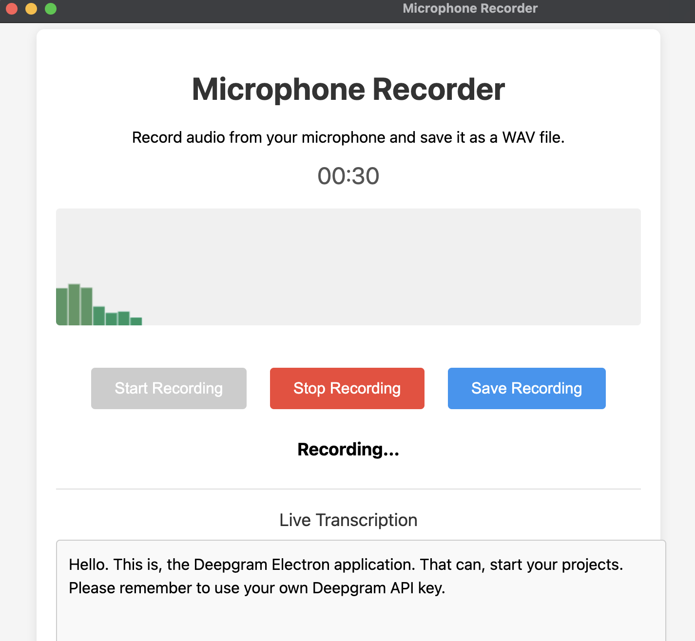

# Electron Microphone Recorder with Deepgram Transcription

A desktop application built with Electron that allows you to record audio from your microphone, save it as a WAV file, and get real-time transcription using [Deepgram's API ](https://developers.deepgram.com/home/introduction).

## Features

- 🎤 High-quality audio recording from your microphone
- 📊 Real-time audio visualization
- ⏱️ Recording timer display
- 💾 Save recordings as WAV files
- 🔤 Live speech-to-text transcription using Deepgram
- 🎨 Modern and intuitive user interface



## Prerequisites

Before you begin, ensure you have the following installed:
- Node.js (v12 or higher)
- npm (Node Package Manager)

## Installation

1. Clone this repository:
```bash
git clone [your-repository-url]
cd electron-mic-recorder-deepgram
```

2. Install dependencies:
```bash
npm install
```

3. Create a `.env` file in the root directory and add your Deepgram API key:
```
DEEPGRAM_API_KEY=your_api_key_here
```

## Usage

1. Start the application:
```bash
npm start
```

2. Click the "Start Recording" button to begin recording audio
3. The audio visualization will show your audio input levels
4. Live transcription will appear in the transcription box
5. Click "Stop Recording" when finished
6. Click "Save Recording" to save your audio file
7. Choose a location to save your WAV file

## Features in Detail

### Audio Recording
- Records audio in WAV format
- Shows real-time audio visualization
- Displays recording duration

### Live Transcription
- Real-time speech-to-text conversion
- Supports interim results for immediate feedback
- Uses Deepgram's Nova-2 model for high accuracy
- Includes smart formatting and punctuation

### User Interface
- Clean, modern design
- Intuitive controls
- Visual feedback for recording status
- Auto-scrolling transcription display

## Security

- API keys are securely handled through environment variables
- Audio data is processed locally
- Transcription data is processed through secure WebSocket connections

## Development

The application is built with:
- Electron - for the desktop application framework
- Web Audio API - for audio recording and visualization
- Deepgram SDK - for real-time transcription
- HTML5/CSS3 - for the user interface

## License

[Your chosen license]

## Contributing

Contributions are welcome! Please feel free to submit a Pull Request. 